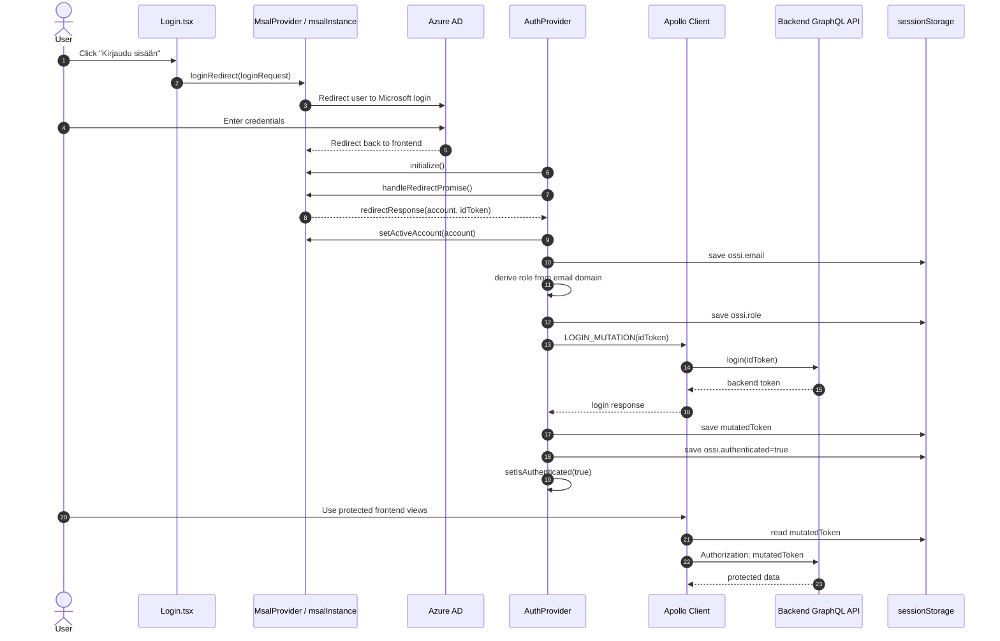
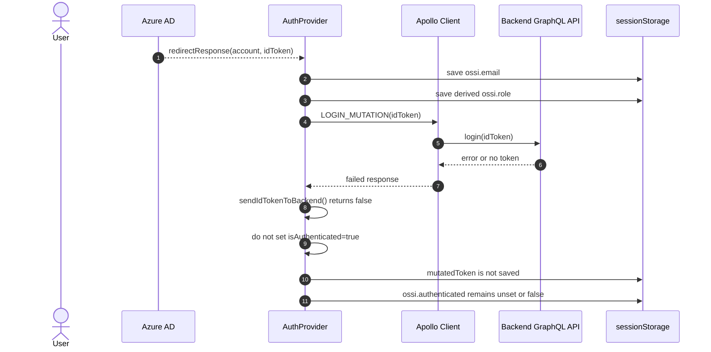
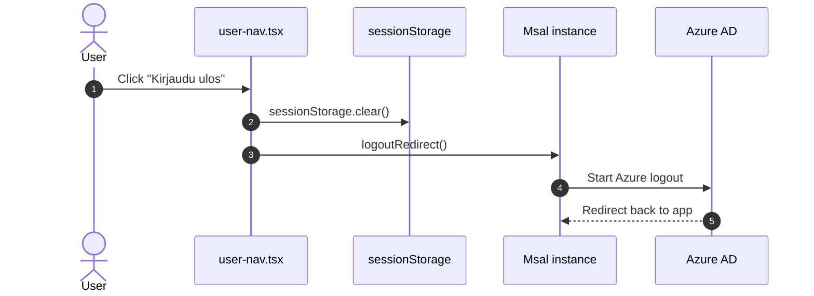
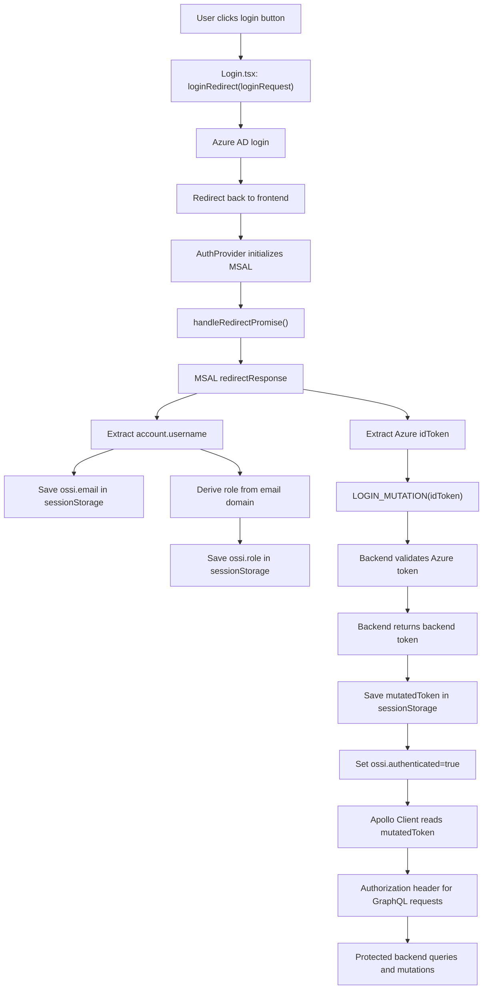

# Authentication Flow

This document describes how authentication currently works in OSSI 2.0 frontend when signing in through Azure AD and then exchanging the Azure token for a backend token.

## Scope

This document covers:

- Azure AD login redirect flow
- frontend MSAL initialization
- backend token exchange with `LOGIN_MUTATION`
- how authenticated GraphQL traffic is authorized
- logout flow
- runtime data stored in `sessionStorage`

Main files:

- [authConfig.ts](/Users/purot/ossi/ossi2.0-front/authConfig.ts)
- [src/components/Login.tsx](/Users/purot/ossi/ossi2.0-front/src/components/Login.tsx)
- [src/components/auth-provider.tsx](/Users/purot/ossi/ossi2.0-front/src/components/auth-provider.tsx)
- [src/utils/auth-utils.ts](/Users/purot/ossi/ossi2.0-front/src/utils/auth-utils.ts)
- [src/graphql/LoginMutation.tsx](/Users/purot/ossi/ossi2.0-front/src/graphql/LoginMutation.tsx)
- [src/graphql/apolloClient.ts](/Users/purot/ossi/ossi2.0-front/src/graphql/apolloClient.ts)
- [src/components/layout/user-nav.tsx](/Users/purot/ossi/ossi2.0-front/src/components/layout/user-nav.tsx)

## High-Level Summary

Authentication happens in two stages:

1. The user signs in with Azure AD through MSAL.
2. The frontend sends the Azure `idToken` to the backend using `LOGIN_MUTATION`, and the backend returns its own token.

The application does not use the Azure `idToken` directly for normal GraphQL traffic. Instead, the backend-issued token is stored in `sessionStorage` as `mutatedToken` and attached to GraphQL requests in the `Authorization` header.

## Components And Responsibilities

### `authConfig.ts`

Defines the MSAL configuration:

- Azure client id
- tenant id
- redirect URIs
- cache location
- requested scopes for login

MSAL cache is configured to use `sessionStorage`.

### `Login.tsx`

Shows the login button and starts the Azure login redirect flow:

```ts
instance.loginRedirect(loginRequest);
```

### `auth-utils.ts`

Creates the shared `msalInstance` and registers an MSAL event callback.

The callback currently:

- listens for `LOGIN_SUCCESS`
- sets the active account
- updates the user email in frontend state

Important:
The event callback does not complete backend authentication by itself. The backend token exchange is handled in `AuthProvider`.

### `auth-provider.tsx`

This is the main authentication coordinator. It:

- initializes MSAL
- handles the Azure redirect response
- extracts the Azure `idToken`
- sends the `idToken` to backend using `LOGIN_MUTATION`
- stores the backend token in `sessionStorage`
- marks the user authenticated only after backend login succeeds
- derives role from email domain

### `LoginMutation.tsx`

Defines:

```graphql
mutation Login($idToken: String!) {
  login(idToken: $idToken) {
    message
    status
    success
    token
  }
}
```

### `apolloClient.ts`

Reads `sessionStorage.mutatedToken` and injects it into every GraphQL request:

```ts
Authorization: token ? token : ''
```

### `user-nav.tsx`

Handles logout by:

1. clearing `sessionStorage`
2. calling `instance.logoutRedirect()`

## Successful Login Sequence



## Failed Login Sequence

This sequence covers the case where Azure login succeeds, but backend token exchange fails.



## Logout Sequence



## Data Flow



## Runtime Storage

The following keys are used in `sessionStorage`:

- `ossi.authenticated`
  - stringified boolean
  - set to `true` only after backend token exchange succeeds
- `ossi.email`
  - Azure account username/email
- `ossi.role`
  - stringified role derived from email domain or manually overridden in development
- `mutatedToken`
  - backend-issued token used for GraphQL authorization

## Role Derivation

Role is derived in frontend from email domain:

- `@esedulainen.fi` -> `student`
- `@esedu.fi` -> `teacher`
- otherwise -> `unknown`

This happens in `AuthProvider` after `userEmail` is known.

In development, role can also be manually changed from the user menu.

## Important Implementation Notes

### Authentication is not complete at Azure redirect alone

The user may successfully sign in with Azure, but the frontend only treats the user as authenticated after backend login succeeds and `mutatedToken` is stored.

### MSAL event callback is supportive, not authoritative

`handleMsalEventCallback()` updates the active account and email on `LOGIN_SUCCESS`, but the authoritative login completion still happens in `AuthProvider` through:

1. `handleRedirectPromise()`
2. `LOGIN_MUTATION`
3. backend token storage

### GraphQL traffic uses backend token, not raw Azure token

Normal application requests do not use the Azure `idToken` directly. The `idToken` is only used once for backend login exchange.

### Logout clears local frontend auth state first

`user-nav.tsx` clears `sessionStorage` before redirecting to Azure logout. This means:

- local auth state is removed immediately
- backend token is discarded immediately
- Azure session is ended through `logoutRedirect()`

## Current Limitations And Risks

- `idToken` is currently logged to console in `auth-provider.tsx` for testing and should be removed in production-safe code.
- Role derivation is frontend domain-based, so it depends on email naming conventions.
- `sessionStorage` means auth state is tab-scoped and cleared when the browser session ends.

## Suggested Follow-Up Improvements

1. Remove the temporary `console.log(idToken)` from `auth-provider.tsx`.
2. Document backend-side `login(idToken)` validation separately.
3. Add a small auth state diagram for `unknown -> redirect pending -> backend authenticated`.
4. Add explicit error UI for backend login failures after Azure redirect succeeds.
